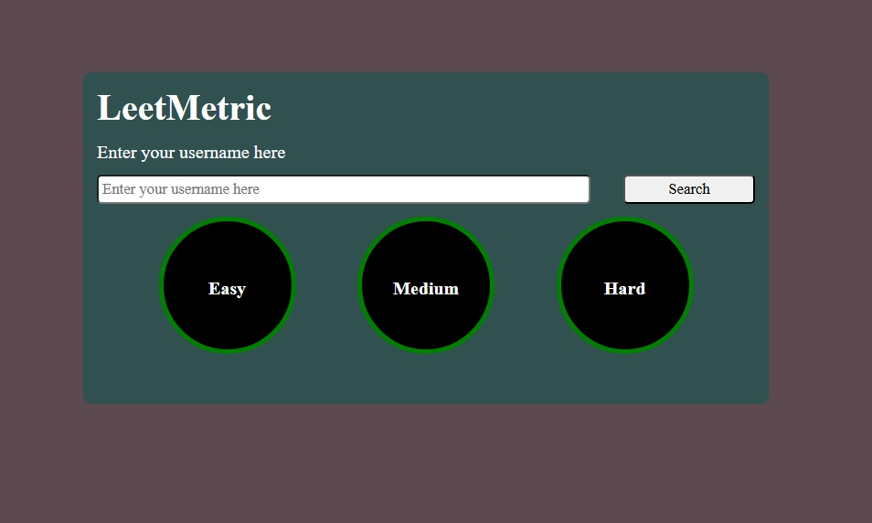

# leetCodeMetricsApp
An app that helps to get leetcode metrics for a candidate using username.

How to use ?

Enter your leetcode Profile username in the "Enter your username here" box

Click on Search button
 

LeetMetrics will be shown.

  

 1.Pie charts showcasing total questions solved for all difficulty levels.

 2. Stats card depicting Total submissions and submissions for each difficulty level.

